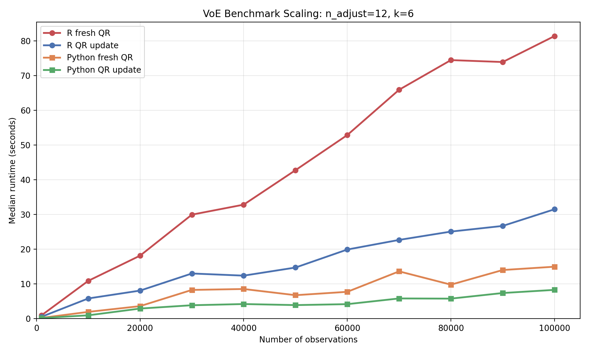
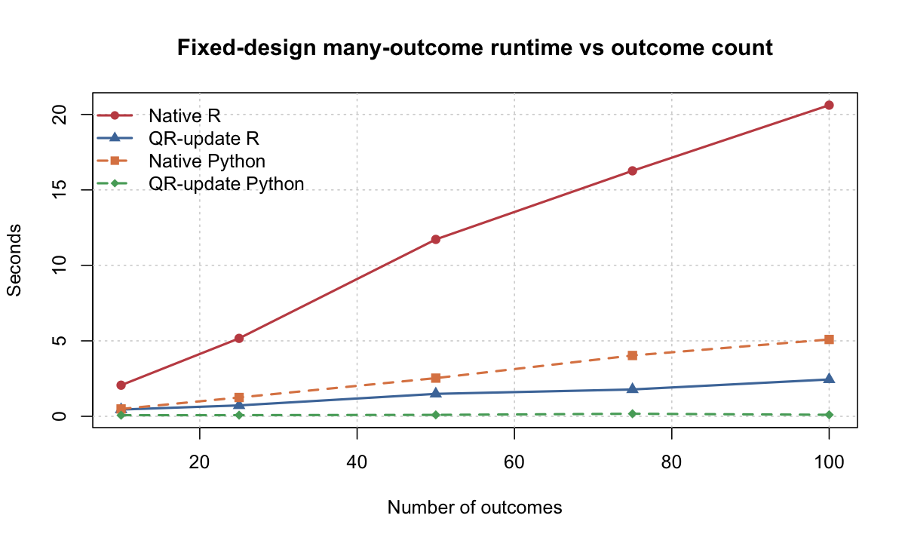
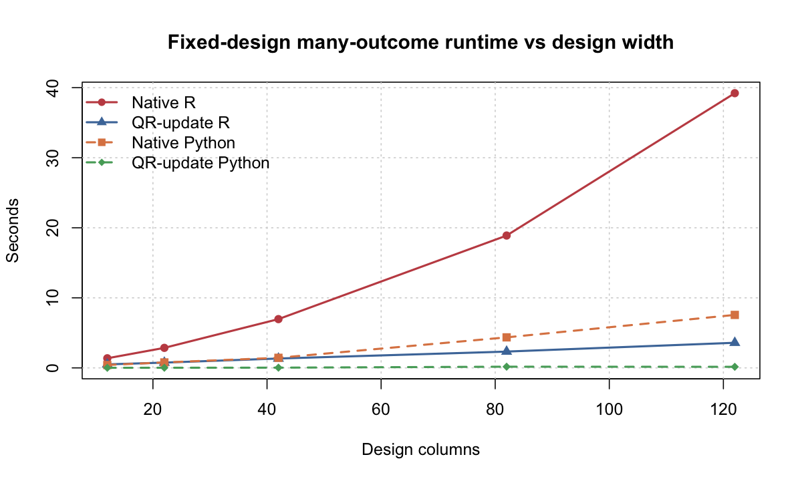
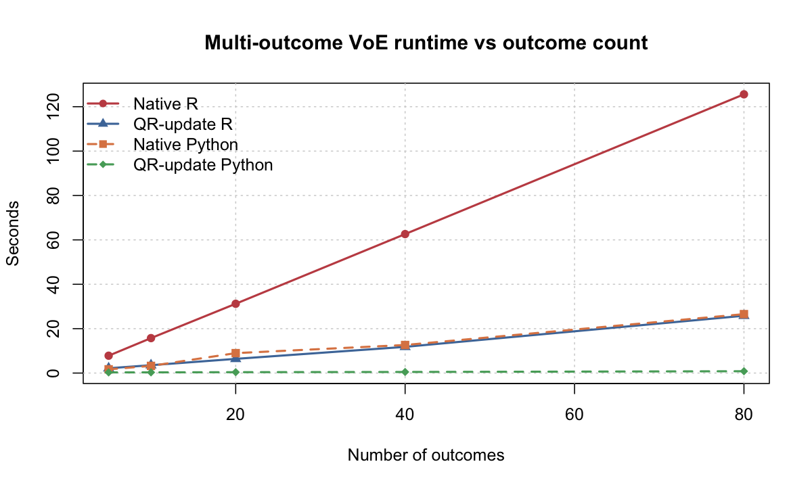

# QR Speedup Benchmarks

These scripts benchmark the Gaussian VoE QR-update path against per-model
baselines inside this `voe` fork. Depending on the benchmark, the baseline is
either:

- a fresh full QR factorization for every model
- repeated native `lm()` fits in R
- repeated native `numpy.linalg.lstsq()` fits in Python

## Why The QR Backend Is Faster

The QR speedup comes from reusing work that is shared across nearby models.

- In single-outcome VoE, consecutive adjustment sets usually differ by only a
  few columns, so the QR backend updates an existing factorization instead of
  recomputing `qr(X_sub)` from scratch for every subset.
- In many-outcome workloads, the same design matrix is reused across outcomes,
  so one QR factorization can be shared across all outcomes instead of fitting
  each outcome independently.
- In multi-outcome VoE, the QR path combines both ideas: it reuses the
  factorization across adjustment subsets and solves all requested outcomes from
  the same active design.

That is why the single-outcome benchmark shows moderate gains, while the
many-outcome and wider-matrix benchmarks can show much larger gains.

## How To Read The Plots

- `QR-update R` and `QR-update Python` are the fast paths that reuse QR state.
- `Fresh QR` means the design context is reused, but a new full QR
  factorization is rebuilt for every model.
- `Native R` means repeated `lm()` fits.
- `Native Python` means repeated `numpy.linalg.lstsq()` fits.
- Exact timings are machine-dependent. The checked-in plots are most useful for
  comparing scaling trends and relative speedups.

## Checked-In Benchmark Plots

### 1. Single-Outcome VoE Runtime vs Dataset Size

This is the benchmark closest to the current single-outcome public API. It uses
synthetic Gaussian VoE with `n_adjust = 12`, `k = 6`, and `n_obs` from `1,000`
to `100,000`. The four lines are `R fresh QR`, `R QR update`, `Python fresh
QR`, and `Python QR update`.

On this machine, the QR-update path is consistently faster than fresh
refactorization, with the R speedup landing around `1.8x` to `3.0x` and the
Python speedup around `1.2x` to `2.3x` across the checked-in run.



### 2. Fixed-Design Many-Outcome Runtime vs Outcome Count

This reproduces the older `old_qr_work` style workload more closely: one fixed
design matrix with `n_obs = 23,922` and `89` design columns is reused across
many outcomes. This is the benchmark where the larger historical R speedups
start to reappear.

In the checked-in run, the R QR path grows from about `4.6x` to `9.1x` faster
than repeated `lm()` fits as the number of outcomes increases. The Python QR
path is even farther below its native repeated-OLS baseline.



### 3. Fixed-Design Many-Outcome Runtime vs Design Width

This holds `n_obs = 23,922` and `100` outcomes fixed while increasing the
number of design columns. It isolates the effect of matrix width on the QR
speedup.

The main pattern is monotone: as the design gets wider, recomputing the full
baseline fit becomes much more expensive, while the QR-update path grows more
slowly. In the checked-in R run the speedup reaches about `10.9x` at `122`
design columns.



### 4. Multi-Outcome VoE Runtime vs Outcome Count

This is the actual multi-outcome Gaussian VoE benchmark rather than the simpler
fixed-design toy benchmark. The checked-in run uses `n_obs = 2,000`,
`n_adjust = 12`, `k = 6`, and varies the number of outcomes from `5` to `80`.

This plot shows that the multi-outcome QR implementation captures a substantial
part of the many-outcome benefit inside the real VoE API: in the checked-in
results, R is about `3.6x` to `5.3x` faster than repeated single-outcome
`lm()` enumeration, and Python is about `5.6x` to `32.2x` faster than repeated
native OLS enumeration.



## Files

- `benchmark_voe_qr_speedup.R`: R benchmark runner
- `benchmark_many_outcomes_qr_lm.R`: old-style fixed-design benchmark, reusing one QR across many outcomes and comparing against repeated `lm()` fits
- `benchmark_many_outcomes_outcome_sweep.R`: R sweep over outcome count for the old-style fixed-design benchmark
- `benchmark_voe_multioutcome_lm_baseline.R`: multi-outcome Gaussian VoE benchmark in R against repeated single-outcome `lm()` enumeration
- `benchmark_voe_multioutcome_outcome_sweep.R`: R sweep over outcome count for multi-outcome VoE
- `benchmark_many_outcomes_width_sweep.R`: width sweep for the old-style many-outcome benchmark, with optional CSV and plot outputs
- `plot_cross_language_4line.R`: combines one R CSV and one Python CSV into a 4-line runtime plot
- `benchmark_discrepancy_helpers.R`: shared helpers for the discrepancy-analysis benchmarks
- `regenerate_nhanes_fixture.R`: rebuilds the shared NHANES-derived CSV fixture
- `data/nhanes_voe_gaussian.csv`: committed benchmark fixture shared by R and Python
- `../python/benchmarks/benchmark_voe_qr_speedup.py`: Python benchmark runner
- `../python/benchmarks/benchmark_many_outcomes_qr_native.py`: old-style fixed-design benchmark in Python against repeated native OLS fits
- `../python/benchmarks/benchmark_many_outcomes_outcome_sweep.py`: Python sweep over outcome count for the fixed-design benchmark
- `../python/benchmarks/benchmark_many_outcomes_width_sweep.py`: Python width sweep for the fixed-design benchmark
- `../python/benchmarks/benchmark_voe_multioutcome_native_baseline.py`: multi-outcome Gaussian VoE benchmark in Python against repeated native OLS enumeration
- `../python/benchmarks/benchmark_voe_multioutcome_outcome_sweep.py`: Python sweep over outcome count for multi-outcome VoE
- `../python/benchmarks/benchmark_discrepancy_helpers.py`: shared Python helpers for the discrepancy-analysis benchmarks

## Regenerate The NHANES Fixture

```bash
cd /Users/randalljellis/Documents/qr_trick/voe
Rscript benchmarks/regenerate_nhanes_fixture.R
```

This writes `benchmarks/data/nhanes_voe_gaussian.csv` with the columns:

- `LBXVID`
- `LBXBCD_log_z`
- `RIDAGEYR`
- `male`
- `SES_LEVEL`
- `current_past_smoking`
- `education`
- `RIDRETH1`
- `any_cad`
- `any_ht`
- `any_diabetes`

## Run The Benchmarks

```bash
cd /Users/randalljellis/Documents/qr_trick/voe
Rscript benchmarks/benchmark_voe_qr_speedup.R --dataset synthetic
Rscript benchmarks/benchmark_voe_qr_speedup.R --dataset nhanes --reps 3

python3 python/benchmarks/benchmark_voe_qr_speedup.py --dataset synthetic
python3 python/benchmarks/benchmark_voe_qr_speedup.py --dataset nhanes --reps 3

Rscript benchmarks/benchmark_many_outcomes_qr_lm.R --n-obs 23922 --n-covariates 87 --n-outcomes 100
Rscript benchmarks/benchmark_many_outcomes_outcome_sweep.R --n-obs 23922 --n-covariates 87 --outcome-counts 10,25,50,75,100
Rscript benchmarks/benchmark_voe_multioutcome_lm_baseline.R --n-obs 2000 --n-adjust 12 --n-outcomes 100 --k-min 6 --k-max 6
Rscript benchmarks/benchmark_voe_multioutcome_outcome_sweep.R --n-obs 2000 --n-adjust 12 --outcome-counts 5,10,20,40,80 --k-min 6 --k-max 6
Rscript benchmarks/benchmark_many_outcomes_width_sweep.R --n-obs 23922 --n-outcomes 100 --widths 10,20,40,80,120

python3 python/benchmarks/benchmark_many_outcomes_qr_native.py --n-obs 23922 --n-covariates 87 --n-outcomes 100
python3 python/benchmarks/benchmark_many_outcomes_outcome_sweep.py --n-obs 23922 --n-covariates 87 --outcome-counts 10,25,50,75,100
python3 python/benchmarks/benchmark_many_outcomes_width_sweep.py --n-obs 23922 --n-outcomes 100 --widths 10,20,40,80,120
python3 python/benchmarks/benchmark_voe_multioutcome_native_baseline.py --n-obs 2000 --n-adjust 12 --n-outcomes 100 --k-min 6 --k-max 6
python3 python/benchmarks/benchmark_voe_multioutcome_outcome_sweep.py --n-obs 2000 --n-adjust 12 --outcome-counts 5,10,20,40,80 --k-min 6 --k-max 6
```

Both runners support:

- `--dataset synthetic|nhanes`
- `--k-min`
- `--k-max`
- `--reps`
- `--seed`
- `--n-obs` for synthetic data only
- `--n-adjust` for synthetic data only

If `k_min == k_max`, the scripts benchmark the fixed-`k` public API. Otherwise
they benchmark the exhaustive API over the requested `k` range.

## Output Fields

Each script prints:

- dataset preset
- row count
- adjustor count
- model count
- `k` or `k` range
- QR median seconds
- baseline median seconds
- speedup multiplier
- max estimate diff from the validation pass
- max BIC diff from the validation pass

Validation runs once before timing and exits non-zero if the QR-backed result
and baseline result disagree beyond tolerance.

## Discrepancy Analysis Benchmarks

These additional R scripts help explain why older `old_qr_work` experiments can
show much larger speedups than the current end-to-end VoE benchmark:

- `benchmark_many_outcomes_qr_lm.R` mimics the old fixed-design pattern where a
  single QR factorization is reused across many outcomes.
- `benchmark_many_outcomes_outcome_sweep.R` and
  `python/benchmarks/benchmark_many_outcomes_outcome_sweep.py` show how that
  fixed-design speedup scales as the number of outcomes increases.
- `benchmark_voe_multioutcome_lm_baseline.R` measures actual multi-outcome VoE
  enumeration against repeated single-outcome `lm()` fits.
- `benchmark_voe_multioutcome_outcome_sweep.R` and
  `python/benchmarks/benchmark_voe_multioutcome_outcome_sweep.py` show how the
  multi-outcome VoE speedup scales with the number of outcomes.
- `benchmark_many_outcomes_width_sweep.R` varies the number of covariates in the
  fixed-design many-outcome benchmark to show how speedup changes as the design
  matrix gets wider.
- `plot_cross_language_4line.R` turns the paired R and Python CSVs into 4-line
  plots with `Native R`, `QR-update R`, `Native Python`, and
  `QR-update Python`.
